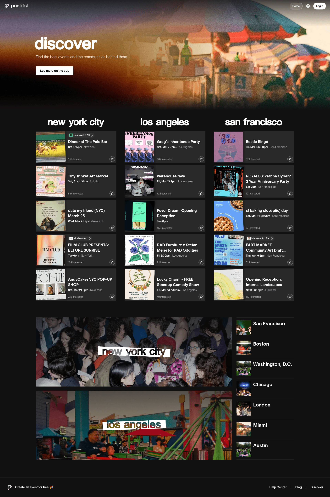
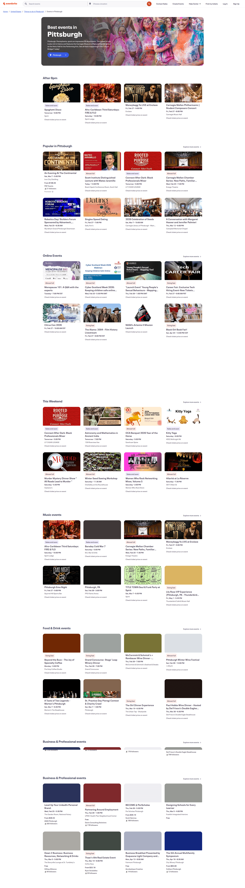
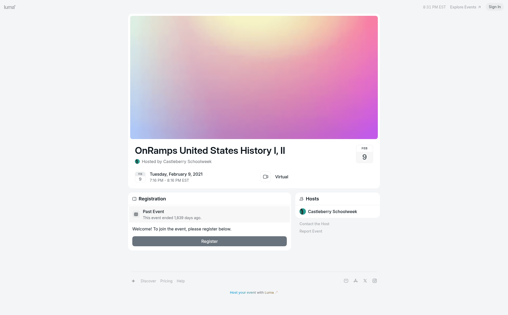
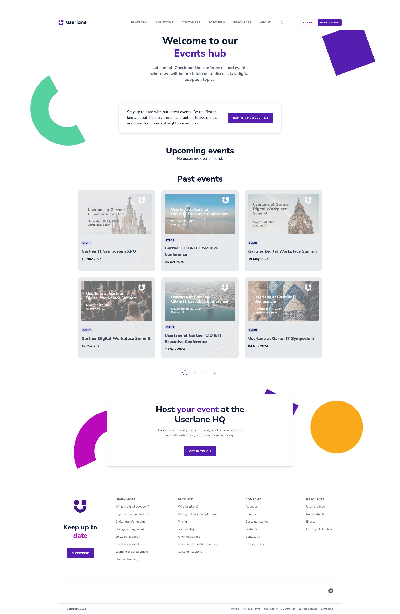

# Design Research: Campus Event Social UI

## TL;DR
Mingle should feel more like a living campus board than a quiet database. The strongest references use image-forward event cards, visible social proof, fast discovery controls, and empty states that point people to the next action.

## Recommendations / Next Steps
1. **Make cards visual first** - Lead with the event image or a colorful fallback poster, then host, title, location, and interest action. This borrows from Eventbrite and Partiful, where browsing starts visually before users parse detail text.

```
+--------------------------------+
| image / poster          tag    |
|                                |
| date + location panel          |
+--------------------------------+
| host                           |
| title                          |
| short description              |
| Interested        Read more    |
+--------------------------------+
```

2. **Give empty states a job** - Empty areas should explain what happened and provide the next useful action. For Mingle, "no upcoming events" should link to Discover, not leave the user stranded.

```
+-------------------------------+
| icon                          |
| No upcoming signups yet       |
| Find something worth saving.  |
| [Discover events]             |
+-------------------------------+
```

3. **Avoid fake sorting language** - Trending needs a real signal such as time-decayed interest, recent saves, or attendance velocity. If it only mirrors interest count, the label should be removed until the app has the data to support it.

```
Sort: [Date] [Interest]
```

4. **Use expressive but structured page headers** - References with personality still keep hierarchy clear: color bands, count pills, visual cards, and concise copy.

```
+-------------------------------------------+
| color strip                               |
| Discover Events                  12 matches|
| Find the right room by timing...          |
+-------------------------------------------+
```

## Key Examples

*Partiful - city-based discovery with curated event groupings and a warmer social tone [Lazyweb]*


*Eventbrite - searchable event discovery with image cards, date, location, and category sections [Lazyweb]*


*Luma - focused event detail page with clear host, time, status, and registration action [Lazyweb]*


*Userlane - event hub pattern with upcoming and past cards plus a creation CTA [Lazyweb]*

## Patterns
- Event cards work best when they use a stable visual frame, readable date/location metadata, and one clear primary action.
- Discovery pages should support quick sorting and category filtering without making users decode the system.
- Social proof matters more when it is concrete: interested count, attending friends, host identity, or community context.
- Empty states are part of the product flow, not placeholders.

## Anti-Patterns
- A "Trending" tab without a distinct ranking formula creates false expectations.
- Plain dashed boxes with only text do not help users recover from empty states.
- Dynamic profile and detail links must resolve instantly; a 404 after clicking a visible person or event breaks trust.

## Findings
Lazyweb results aligned around four useful directions: image-forward browsing from Eventbrite, more playful social energy from Partiful, focused event detail pages from Luma, and hub-style upcoming/past grouping from Userlane. Web research reinforced that event discovery is fragmented and users need help finding relevant items quickly, while empty-state guidance recommends providing a clear next step.

Live screenshot capture was unavailable in this workspace (`NO_BROWSE`), so this report uses downloaded Lazyweb references and web research links rather than fresh browser captures.

## Sources
- Lazyweb: Partiful discover page, Eventbrite discovery page, Luma event detail page, Userlane events hub.
- Web: https://design.aia.com/component/empty-state
- Web: https://www.meetscouty.com/blog/best-event-discovery-apps-2026
- Web: https://partiful.com/discover
- Web: https://www.eventbrite.com/d/pa--pittsburgh/events/
- Web: https://luma.com/us/en/x2nmvwx5
